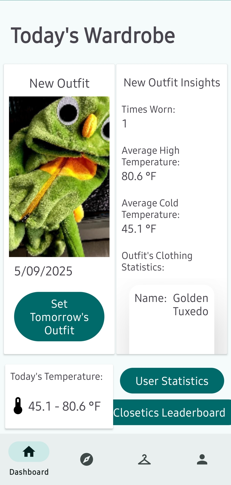
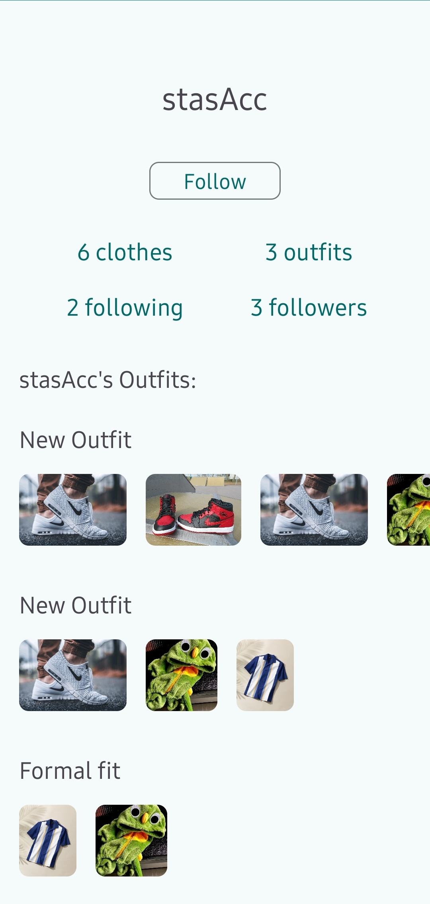
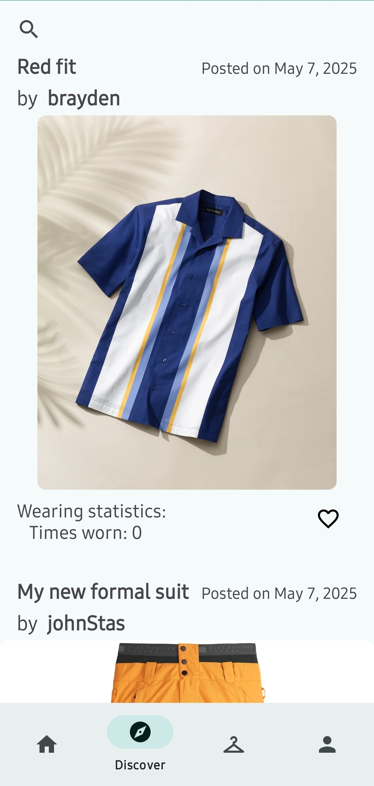
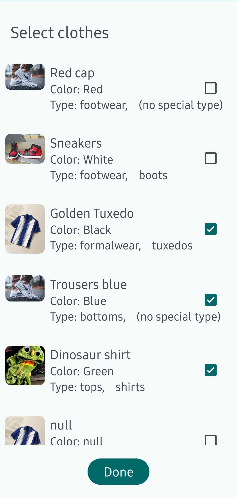
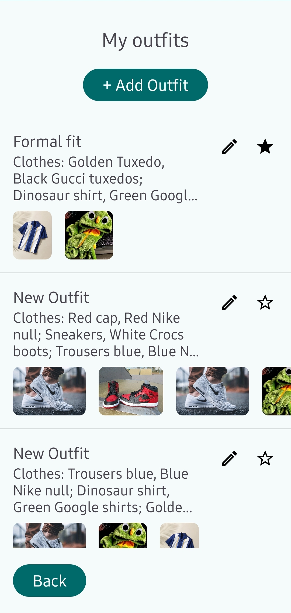
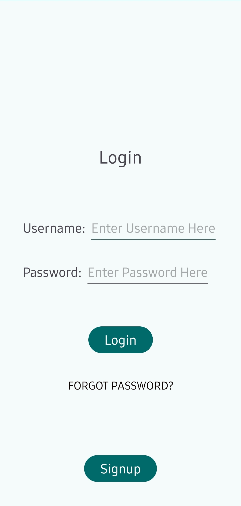
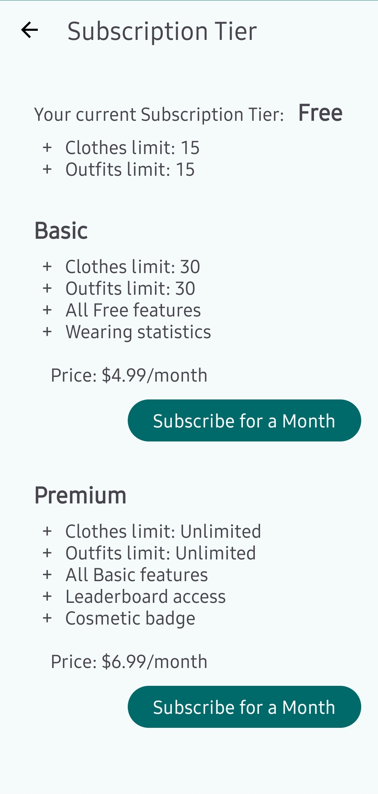
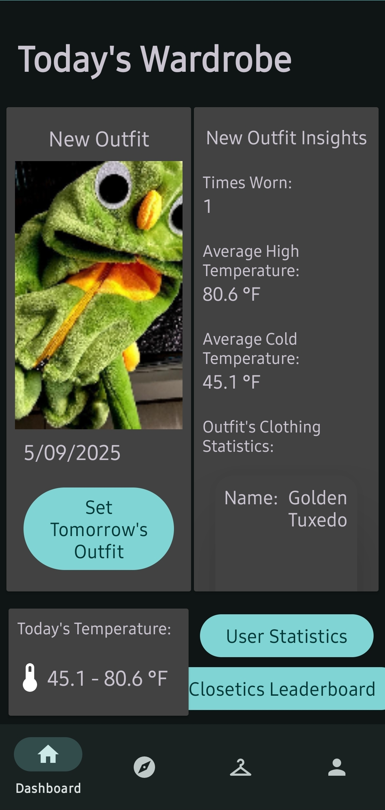
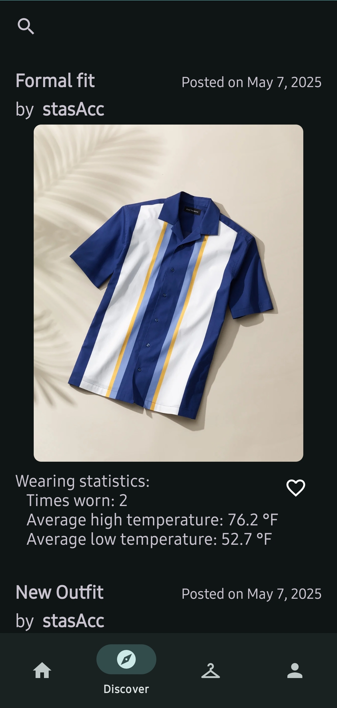

# Closetics


**Closetics** is a unique Android app that blends clothes wearing statistics with social media. Designed for fashion enthusiasts, it helps you track your clothing habits, discover outfit trends, and share your style with a community of like-minded users.


## Features
- **Wear Tracking**: Automatically logs your daily outfits and tracks how often each clothing item is worn. Uses Weather API to collect related temperature data.
- **Smart Statistics**: Get insightful analytics on your wearing patterns.
- **Outfit Sharing**: Post your outfits to your profile and share them with a community.
- **Personalized Recommendations**: Scroll through a feed of outfit suggestions based the users you follow.
- **Dark Mode**: Enjoy an eye-friendly interface with full dark mode support.


## Tech Stack

### Frontend
- **Platform**: Android
- **Language**: Java
- **IDE**: Android Studio

### Backend
- **Framework**: Spring Boot
- **Language**: Java
- **Database**: MySQL

### Payments
- **Stripe API** is used to handle subscription payments.


## Setup Instructions

### Prerequisites
- Android Studio installed
- Java 11 or higher
- Maven

### Installation

1. Clone the Repository
    ```bash
    git clone https://github.com/Niall-Sharma/Closetics.git
    cd Closetics
    ```

2. Run the Backend
    ```bash
    cd Backend
    ./mvnw spring-boot:run
    ```
    _The Backend runs on the port `8080` by default_

3. Run the Android App
    Open `Frontend` folder in Android Studio
    Build and run on an emulator or physical device

   _By default, Backend URL is `localhost:8080`. You can chnage it by modifying `SERVER_ADDRESS` constant in `Frontend\app\src\main\java\com\example\closetics\MainActivity.java`_


## Screenshots

        


## Authors

Ashten Finders

Brayden Hayworth

Niall Sharma

Stas Bronevskiy
